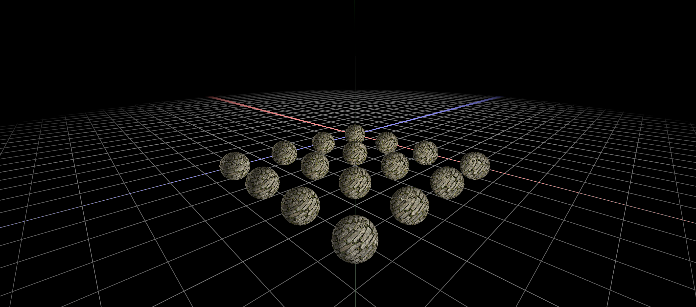

# Zephyr :construction:




A real-time 3D renderer built with Vulkan.


## Requirements

- CMake 3.11+
- Vulkan SDK
- vcpkg (for dependencies)
- C++20 compiler

## Getting started

```sh
cmake -B build -S .
cmake --build build
./build/zephyr
```

Shaders need to be compiled separately (for now):

```sh
./compile_shaders.sh
```

## Roadmap

### Build & Tooling
- [ ] Automatic shader compilation in CMake
- [ ] Shader hot-reloading
- [ ] Debug / Release build configs
- [ ] GPU timestamp queries
- [ ] RenderDoc capture helpers
- [ ] ImGui debug panel
- [ ] Asset packing pipeline (textures, models → packed format)
- [ ] Scene loading / serialization
- [ ] Frame metrics overlay (FPS, draw calls)

### Vulkan Improvements
- [x] Push constants
- [x] Dynamic uniform buffers
- [x] Descriptor allocator
- [ ] Dedicated transfer queue & command pool
- [ ] Pipeline cache
- [ ] Multi-frame resource buffering cleanup
- [ ] MSAA
- [ ] VK_KHR_dynamic_rendering
- [ ] Vulkan Memory Allocator (VMA)
- [ ] Timeline semaphores

### Rendering Features
- [ ] Instanced rendering
- [ ] Frustum culling
- [ ] Basic material system
- [ ] Model loading (glTF 2.0)
- [ ] Skybox / cubemaps
- [ ] Shadow mapping
- [ ] HDR rendering
- [ ] Tone mapping
- [ ] Bloom
- [ ] SSAO
- [ ] Post-processing passes
- [ ] Deferred rendering

### Long-Term
- [ ] Frame graph
- [ ] Deferred rendering
- [ ] Forward+
- [ ] GPU culling (indirect draws)
- [ ] Compute shaders
- [ ] Ray tracing (VK_KHR_ray_tracing_pipeline)

## Dependencies

- [Vulkan](https://www.vulkan.org/) - graphics API
- [GLFW](https://www.glfw.org/) - windowing and input
- [GLM](https://github.com/g-truc/glm) - math library
- [stb_image](https://github.com/nothings/stb) - texture loading

## License

MIT
